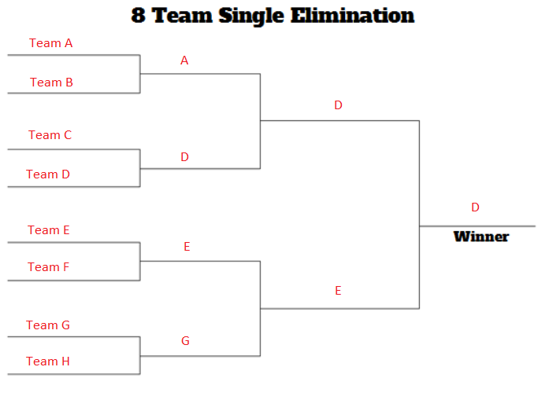
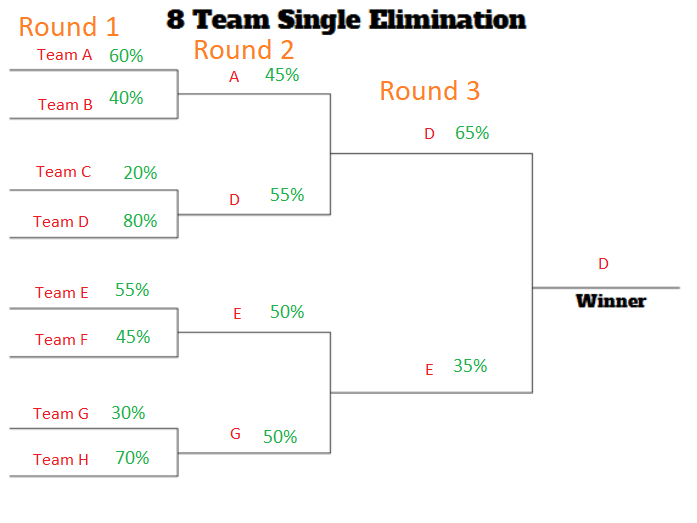

```{r global_options, include=FALSE}
library(knitr)
knitr::opts_chunk$set(fig.pos = '!h')
```

*Title:* Tournament Bracket Simulation and Analysis  
*Group Number:* 3  
*Members:* Eric Auster (eauste2), Philip Dohm (pdohm2), Yuchen Li (li215), Ziqin Xiong (zxiong8), Jeffrey Chao (jschao2)  
*Leader:* Eric Auster   

```{r, echo=F}
# need to call funtions in document

#' Generates team powers based on the normal distribution.
#' @author Yuchen Li
#'
#' @param n is the number of teams.
#' @param mean is the mean of the normal distribution.
#' @param sd is the standard deviation of the normal distribution.
#'
#' @return a vector of team powers, sorted in decreasing order.
#'
genNormalPowers <- function(n, mean=0, sd=1) {
    powers <- rnorm(n, mean, sd)
    return(sort(abs(powers), decreasing=TRUE))
}

#' Performs the Accept-Reject method.
#' @author Yuchen Li
#' @references Yuchen Li (li215), HW2, Exercise 4
#'
#' @param nsim is the number of simulations.
#' @param f is the target distribution.
#' @param min is the minimum value in the domain of f.
#' @param max is the maximum value in the domain of f.
#' @param M >= sup{f(x)}
#' 
#' @return a vector of random variates sampled from f using the
#' Accept-Reject method with Unif(min, max) as the reference distribution.
#'
acceptReject <- function(nsim, f, min, max, M) {
    k1 = 0             # counter for accepted samples
    j1 = 0             # number of iterations required to get desired sample size
    y1 = numeric(nsim) # storing the sample
    while(k1 < nsim){
        u = runif(1)
        x = runif(1, min, max)  # random variate from reference distribution
        g1 = 1
        if (u < f(x) / M / g1) {
            # condition of accepting x in our sample
            k1 = k1 + 1
            y1[k1] = x
        }
        j1 = j1 + 1
    }
    return(sort(y1, decreasing=TRUE))
}

#' Performs the Inverse CDF method.
#' @author Yuchen Li
#' 
#' @param n is the number of simulations.
#' @param inv_cdf is the inverse CDF function for f.
#' 
#' @return a vector of random variates sampled from PDF f using the
#' Inverse CDF method.
#' 
inverseCDF <- function(n, inv_cdf) {
    u = runif(n)
    y = numeric(n)
    for (i in 1:n) {
        y[i] = inv_cdf(u[i])
    }
    return(sort(y, decreasing=TRUE))
}

#' Generates cross team winning probabilities.
#' @author Yuchen Li
#' 
#' @param powers is the team powers.
#' 
#' @return an n x n matrix M where M_{ij} is the probability of team-i beating team-j
genCrossTeamWinningProbabilities <- function(powers) {
    n = length(powers)
    probs = matrix(nrow=n, ncol=n)
    for (i in 1:n) {
        for (j in 1:n) {
            probs[i,j] = powers[i] / (powers[i] + powers[j])
        }
    }
    return(probs)
}

#' Creates a traditional tournament style seeding arrangement. 
#' @author Eric Auster
#'
#' @param size is the number of seeds to generate. This needs
#' to be a power of two.
#'
#' @return a vector containing the seeds.
#'
tournament_seeding = function(size) {
    
    #' Generates the next round of seeding based off the passed in round.
    #'
    #' @param seeds is the previous round of seeding to generate for.
    #'
    nextRound = function(seeds) {
        
        # Next round has twice the size
        nextSize = length(seeds) * 2
        out = numeric(nextSize)
        idx = 1
        
        # Make sure to match up best seed with worst
        for (seed in seeds) {
            out[idx] = seed
            out[idx + 1] = (nextSize + 1) - seed
            idx = idx + 2
        }
        
        return(out)
    }
    
    # Stop if not a power of two
    if (sum(as.numeric(intToBits(size))) != 1) {
        stop("Size must be a power of two")
    }
    
    # Special case when size is 2
    if (size == 2) {
        return(c(1, 2))
    }
    
    # Calculate number of rounds
    rounds = log2(size) - 1
    
    # Start with first two seeds
    seeds = c(1, 2)
    
    # Iteratively generate next seeds
    for (i in 1:rounds) {
        seeds = nextRound(seeds)
    }
    
    return(seeds)
}

#' Creates a seeding arrangement that is left skewed.
#' @author Eric Auster
#'
#' @param size is the number of seeds to generate. This needs
#' to be a power of two.
#'
#' @return a vector containing the seeds.
#'
left_skewed_seeding = function(size) {
    
    # Stop if not a power of two
    if (sum(as.numeric(intToBits(size))) != 1) {
        stop("Size must be a power of two")
    }
    
    # Special case when size is 2
    if (size == 2) {
        return(c(1, 2))
    }
    
    # Create seeds and left/right branches
    seeds = 1:size
    left_seeds = numeric(size / 2)
    right_seeds = numeric(size / 2)
    
    # Indexes for the left/right branches
    left_idx = 1
    right_idx = 1
    
    # Keep track of which branch will get the next seed
    left_turn = TRUE
    
    # For each iteration add the first and last seed to the
    # current branch
    for (i in 1:(size / 2)) {
        if (left_turn) {
            left_seeds[left_idx] = seeds[i]
            left_seeds[left_idx + 1] = seeds[(size + 1) - i]
            left_idx = left_idx + 2
            left_turn = FALSE
        } else {
            right_seeds[right_idx] = seeds[i]
            right_seeds[right_idx + 1] = seeds[(size + 1) - i]
            right_idx = right_idx + 2
            left_turn = TRUE
        }
    }
    
    # Combine branches
    c(left_seeds, right_seeds)
}

#' Creates a random seeding arrangement.
#' @author Eric Auster
#'
#' @param size is the number of seeds to generate. This needs
#' to be a power of two.
#'
#' @return a vector containing the seeds.
#'
random_seeding = function(size) {
    # Stop if not a power of two
    if (sum(as.numeric(intToBits(size))) != 1) {
        stop("Size must be a power of two")
    }
    
    return(sample(1:size, size))
}

#' Simulates a single game between two teams.
#' @author Jeffrey Chao, Philip Dohm
#' 
#' @param teams vector containing the two teams to face-off.
#' @param matchups probability matrix.
#' 
#' @return winner of the game.
#' 
simGame <- function(teams, matchups) {
    team1 <- teams[1]
    team2 <- teams[2]
    matchup <- matchups[team1, team2]
    
    if (runif(1) < matchup) {
        return(team1)
    } else {
        return(team2)
    }
}

#' Simulates an entire round of a tournament.
#' @author Jeffrey Chao, Philip Dohm
#' 
#' @param bracket is the bracket structure.
#' @param matchups is the probability matrix.
#' 
#' @return vector containing the winners of the round.
#' 
simRound <- function(bracket, matchups) {
    nGames <- length(bracket)/2
    outBracket <- c()
    for (game in 1:nGames) {
        teams <- bracket[(2*game - 1):(2*game)]
        winner <- simGame(teams, matchups)
        outBracket <- c(outBracket, winner)
    }
    
    return(outBracket)
}

#' Simulates an entire tournament given a bracket and probability matrix.
#' @author Jeffrey Chao, Philip Dohm, Ziqin Xiong
#' 
#' @param bracket is the bracket structure.
#' @param matchups is the probability matrix.
#' @param rank logical; if TRUE, return final standing of teams instead 
#' of winners and wins count. Set to FALSE by default
#' 
#' @return list containing the tournment winner and vector that stores
#' how many wins each team has gotten. Or if rank = T, a list of 
#' final standing of teams.
#' 
simTournament <- function(bracket, matchups, rank = F) {
    nTeams <- length(bracket)
    newBracket <- bracket
    nRounds <- log2(nTeams)
    
    if(rank){
        results <- numeric(nTeams)
        
        for (round in 1:nRounds) {
            oldBracket <- newBracket
            newBracket <- simRound(newBracket, matchups)
            results[(2^(nRounds-round)+1):2^(nRounds-round+1)] <- 
                setdiff(oldBracket,newBracket)
        }
        
        results[1] <- newBracket
        return(results)
    }
    else{
        results = c("Winner"=-1,"WinsPerTeam"=list(rep(0, ncol(matchups))))
        
        for (round in 1:nRounds) {
            #winsPrev = results["WinsPerTeam"]
            newBracket <- simRound(newBracket, matchups)
            for(i in newBracket){
                results$WinsPerTeam[i] = results$WinsPerTeam[i]+1
            }
        }
        
        results["Winner"] = newBracket
        return(results)
    }
}

#' Gets the prior and posterior number of wins (and probabilities) for every team.
#' @author Philip Dohm
#'
#' @param oldBracket is the prior bracket to generate expected wins from.
#' @param newBracket is the posterior bracket to generate expected wins from.
#' @param matchups is the probability matrix.
#' @param nSim is the number of simulations.
#' 
#' @return list of data frame containing number of wins and prior and posterior frequencies
#'          and probabilities.
#' 
bayesianTeam <- function(oldBracket, newBracket, matchups, nSim=10000) {
    nTeams <- ncol(matchups)
    diffRounds <- log2(length(oldBracket) / length(newBracket))
    nGames <- log2(nTeams)
    priorWPT <- postWPT <- matrix(0, nrow=nTeams, ncol=nSim)
    for (i in 1:nSim) {
        priorWPT[,i] <- simTournament(oldBracket, matchups)$WinsPerTeam
        postWPT[,i] <- simTournament(newBracket, matchups)$WinsPerTeam
        for (team in oldBracket) {
            if (any(newBracket == team)) {
                postWPT[team, i] <- postWPT[team, i] + diffRounds
            }
        }
    }
    
    out <- list()
    for (team in 1:nTeams) {
        ap <- matrix(0, nrow=nGames+1, ncol=3)
        ap <- as.data.frame(ap)
        colnames(ap) <- c("wins", "priorFreq", "postFreq")
        ap$wins <- 0:nGames
        for (win in 0:nGames) {
            ap[win+1, 2] <- length(which(priorWPT[team,] == win))
            ap[win+1, 3] <- length(which(postWPT[team,] == win))
        }
        ap$priorProb <- ap$priorFreq / nSim
        ap$postProb <- ap$postFreq / nSim
        out[[team]] <- ap
    }
    
    return(out)
}

#' Generates bootstrap replicates.
#' @author Ziqin Xiong
#' 
#' @param x is a vector of team ranking or other measure of team power in different simulations.
#' @param B is number of replicates to generate.
#' @param estimator is the statistic we want, set as mean by default.
#' @param l is the length of bootstrap resample in each run.
#' 
#' @return list of bootstrap replicates, bias and standard error.
#' 
boot_replicate <- function(x, B = 5000, estimator = mean, l = length(x)){
    boots <- replicate(B, estimator(sample(x,l,replace=TRUE)))
    sd_b <- sd(boots)
    bias_b <- mean(boots - estimator(x))
    list(boot = boots, bias = bias_b, se = sd_b)
}

#' Generate jackknife replicates.
#' @author Ziqin Xiong
#' 
#' @param x is vector of team ranking or other measure of team power in different simulations.
#' @param estimator is the statistic we want, set as mean by default.
#' 
#' @return list of jackknife replicates, bias and standard error.
#' 
jack_replicate <- function(x, estimator = mean){
    n <- length(x)
    jack <- numeric(n)
    #perform jackknife
    for(i in 1:n)
        jack[i] <- estimator(x[-i])
    #bias using jackknife
    bias_j <- (n-1)*(mean(jack)-estimator(x))
    sumsq=sum((jack-mean(jack))^2)
    se_j <- sqrt((n-1)/n)*sqrt(sumsq)
    list(jack = jack,bias = bias_j, se = se_j)
}

#' Get ranks of a team in tournament simulation
#' @author Ziqin Xiong
#' 
#' @param x index of the team
#' @param res simulation results from simTournament using
#' rank = T
#' @param lower logical; if TURE, pick lowest rank for a range of rank. 
#' for example, if rank is 5th-8th, let rank be 8. If FALSE, pick highest. 
#' Set to T by default
#' 
#' @return list of rank of x in simulations
#' 
getRank <- function(x, res, lower = T){
  n <- length(res)
  rank <- numeric(n)
  for(i in 1:n){
    roughrank <- which(res[[i]]==x)
    if(roughrank == 2 | roughrank == 1)
      rank[i] <- roughrank
    #pick lowest rank for a range of rank
    #for example, if rank is 5th-8th, let rank be 8
    else if(lower == T)
      rank[i] <- 2^ceiling(log2(roughrank))
    #if lower = F pick highest rank in range
    else 
      rank[i] <- 2^floor(log2(roughrank))+1
  }
  rank
}
```

-----

## Abstract


-----

## Introduction

Anticipating the winner of a tournament such as in the NBA or MLB is part of what makes watching these sports entertaining.  These tournaments often utilize a “bracket” structure, which is a tree diagram that represents the series of games played.  For example, in the 8 team single elimination bracket seen in Figure 1, the bracket proceeds from left to right, in which Team A plays Team B, Team C plays Team D, and so on.  The winning team of each match is denoted by marking the team name on the parent branch.  Respective parent branches then play each other until we reach the root of the tree, which will denote the winner of the tournament.  

Most major North American professional sports leagues hold a bracket-style tournament at the end of their season, known as a “playoff”.  Notably, the NCAA holds a basketball tournament with 68 college teams, and traditionally, fans will predict brackets outcomes in an event known as “March Madness”.  

```{r, echo=FALSE, out.width = "50%", fig.pos="h", fig.align="center", fig.cap="Figure 1"}

```

Our problem of interest consists of discovering the most likely bracket outcome in a tournament given data on head-to-head matchups between teams.  The outcome of this type of analysis is potentially important to coaches, viewers, and the team members themselves.  It can be especially important to sports bettors, who traditionally rely on human intuition rather than data-driven techniques to make their bets.  According to sports journalist and bracketology expert Richard Sandomir, studying bracket prediction can have relevance beyond sports, such as in pop culture, nature, and history.  

### Goals

Through this analysis, our goal is to answer these questions:  

- How does changing the parameters of the team power distribution and the seeding method affect the tournament outcome?
- What is the probability of winning for each MLB team and how does seeding affect this?
- How do certain preliminary results change the distribution of wins for each team?
- How does seeding affect average team rank?

### Data

We use both generated data and actual data from MLB game history. For more information, see [Data Generation].

### Exploratory Data Analysis

For our simulation, we only use powers of 2 as the number of teams. Additional exploratory data analysis can be found at [MLB Data] and [Bayesian Analysis].


-----

## Methods

### Data Generation
We first generate the team powers using random number generation techniques. For each team, its power is a positive real number that represents its intrinsic strength. We wrote general functions for the inverse CDF and the Accept-Reject methods. In the report, we demonstrate how to use our inverse CDF function to generate a family of Exponential distributions, and how to use our Accept-Reject function to generate a family of Gamma distributions, each under various parameters. We also included a family of Normal distributions as examples of standard distributions, which we construct by calling library routines. We assign the team indices from the strongest team (team 1) to the weakest team (team n).

With the generated team powers, we then generate the cross-team winning probabilities. Given $n$, the number of teams, we generate $M_{n\times n} = \{m_{ij}\;|\;0\leq i,j\leq n\}$, an $n\times n$ matrix where $m_{ij}$ is the probability of team $i$ beating team $j$. We enforce the constraint that $m_{ij} = 1 - m_{ji}$, since team $i$ can either win or lose against team $j$. Specifically, based on the team powers, we define $m_{ij} = \mathbb{P}(i \text{ wins } j) = \operatorname{power}[i] / (\operatorname{power}[i] + \operatorname{power}[j])$.

We will utilize the various data generation methods to study how changing the parameters of the team power distribution, as well as the seeding method, would affect the tournament outcome. Examples of such studies are provided in the [Parameter Analysis via Resampling] section below. To see data generation code, go to the [Appendix] in section [Data Generation Functions].

Additionally, we have looked up some actual game histories and calculated the actual cross-team winning probabilities, as described below.

#### MLB Data

Major League Baseball (MLB) is the oldest and largest professional baseball organization in U.S and Canada. It has 30 teams playing in 2 major leagues: National League (NL) and American League (AL). NL and AL were seperate legal entitles formed in 1876 and 1901 respectively, and they cooperated to found MLB in 1903.  We obtained free MLB game logs from [Retrosheet](www.retrosheet.org). Since game statistics are highly time-sensitive (a strong team may lose its dominance in 1 season), we use recent 3 years' game log (2016, 2017 and 2018) to build the winning probability matrix $M$. 

```{r, echo=F}
gl16 <- read.csv("mlb/mlb_data/GL2016.TXT",header = F)[,c(4,5,10,7,8,11)]
gl17 <- read.csv("mlb/mlb_data/GL2017.TXT",header = F)[,c(4,5,10,7,8,11)]
gl18 <- read.csv("mlb/mlb_data/GL2018.TXT",header = F)[,c(4,5,10,7,8,11)]
gl <- rbind(gl16,gl17,gl18)
colnames(gl) <- c('vteam','vleague','vscore','hteam','hleague','hscore')
#winning probability of visiting teams, where rows are visiting teams and 
#cols are home teams.
#For example (ANAv,CHAh) means the avg probability of ANA winning CHA as a 
#visiting team. This also means the avg probability of CHA losing or drawing
#ANA as a home team (P(lose|draw) = 1-P(win))
#NaN means there's no game records for 2 teams 
win <- lose <- draw <- matrix(0,30,30,dimnames = 
         list(paste0(levels(gl$vteam),'v'),paste0(levels(gl$vteam),'h')))
for(i in 1:nrow(gl)){
  if(gl[i,3]>gl[i,6])
    win[gl$vteam[i],gl$hteam[i]] = win[gl$vteam[i],gl$hteam[i]]+1
  else if(gl[i,3]<gl[i,6])
    lose[gl$vteam[i],gl$hteam[i]] = lose[gl$vteam[i],gl$hteam[i]]+1
  else
    draw[gl$vteam[i],gl$hteam[i]] = draw[gl$vteam[i],gl$hteam[i]]+1
}
total <- win+lose+draw
alltotal <- total*upper.tri(total) + t(total)*upper.tri(total)
alltotal <- alltotal+t(alltotal)
allwin <- win*upper.tri(win) + t(lose)*upper.tri(win) +
  win*lower.tri(win) + t(lose)*lower.tri(lose)
#avg winnning prob not considering visiting & home
#For example (ANA,CHA) means the avg probability of ANA winning CHA
#This matrix could be used directly in sim_tournament_initial.R
mlbM <- allwin/alltotal
dimnames(alltotal) <- dimnames(mlbM) <- list(levels(gl$vteam),levels(gl$vteam))
```

The dataset we are using has a total of $`r nrow(gl)`$ games. We can see one main problem here is although we have this many games in record, many teams do not have many chances to play some other teams. This is because each team basically plays in one of two seperate leagues (NL and AL) and seperate regions during the season, and most of games happen within one region and one league. So we have many records of some teams vs some teams, but less for other teams. In short, this dataset is highly unbalanced. Further discussion about this problem can be found in [Results].

### Tournament Simulation

The first step of simulating a tournament is providing each team with a seed. A seed defines where in the bracket each team will be placed, and usually stronger teams get lower seed numbers while weaker teams get higher seed numbers. The results of the tournament can be greatly affected by how the tournament is seeded, and because of this, we have created three different kinds of seeding functions that are defined in the [Appendix] at section [Seeding Functions]. The most notable seeding function is `tournament_seeding` which generates a bracket layout that is quite common in traditional real world tournaments where the structure is set up in such a way that seed 1 and seed 2 are most likely to be finalists in the last tournament matchup.  

We simulate tournament brackets using Monte Carlo simulation. Given the same set of teams, we simulate tournament results thousands of times to get data on tournament winners and how far on average each team proceeds. Monte Carlo inference works well for this purpose since early round results have a snowball effect on later round results. For example, in Figure 2, we see an example tournament run. If we imagine that Team B beat Team A in round 1 instead, the head-to-head win probability would change for the first match of round 2. Then the probability of D advancing to round 3 and eventually winning would change as well.

```{r, echo=FALSE, out.width = "50%", fig.pos="h", fig.align="center", fig.cap="Figure 2"}

```

The algorithm for simulating a single bracketed tournament can be seen in the appendix under [Simulation Functions], and works roughly as follows:  

1. Take in a tournament bracket in the form of a vector of teams, and a square probability matrix $M$ where $M_{ij}$ is the probability of team $i$ beating team $j$.  
2. Simulate each individual game in round 1, returning a new bracket that represents the teams going into round 2.  Then simulate round 2, returning a new bracket that represents teams going into round 3, and so on, for $\log_2(n)$ rounds where $n$ is the number of teams.  
3. Return the winner of the tournament and a vector of integers representing the number of wins each team had.  

We then get our Monte Carlo simulation results in the form of a 2-D array by using `replicate` on our tournament simulation function.  

### Bayesian Analysis

The motivation for performing Bayesian analysis on brackets is to see how certain results change the distribution of wins for each team. Before any games are played, we can simulate a tournament and estimate prior win distribution for each team. The prior win distribution is just the probability that a team wins a certain number of games. Notice that in a bracket with 16 teams, if a team wins 4 games, they also win the tournament. After some games are played, perhaps an entire round or even a partial round, we can run another simulation and estimate the posterior win distribution for each team. This will allow us to see how much certain early tournament results impact the overall performance of all teams, and ultimately who wins the tournament.

For an example, if the lowest seed team upsets the highest seed team (like UMBC vs. Virginia in March Madness 2018), there may be a significant impact on the rest of the bracket. One possible impact is that the team(s) who would play the top seed in the following round have much better expected performance, because their second round opponent is a weaker team. However, we would not expect this result to impact teams on the other side of the bracket (e.g. the 2 or 3 seed teams) as much as the teams that are "closer" to playing the top seed.

In order to simulate a prior and posterior distribution, we perform a Monte Carlo tournament simulation on the initial bracket, and the updated bracket. See the [Tournament Simulation] section for more information on this. For consistency, we use the same bracket structure (seeding) and matchup matrix (generated from Normal powers) for all simulations. We perform many of these simulations and keep track of the number of wins each team had in each simulation. After a sufficient number of replications, we can estimate how likely each team is to win a certain number of games under both the initial bracket and the updated bracket. We obtain a data frame for each team that looks similar to this:

```{r, echo=F}
n <- 16 # number of teams
nRounds <- log2(n)
set.seed(1) # for consistency
M <- genCrossTeamWinningProbabilities(genNormalPowers(n)) # matchups
t <- tournament_seeding(n) # tournament seeding
tFav <- t[which(t <= n/2)]
bFav <- bayesianTeam(t, tFav, M)
bFav[[1]]
```

Note: we have one of these data frames for every team in the tournament. We can use this information to plot prior and posterior distributions for each team, and analyze the differences. Additionally, we can obtain approximations of each teams expected number of wins and the standard error of that estimate; however, we are more interested in the distributions since they provide more insight into a team's difference in performance. Our distributions look similar to the following, where the dashed line represents the prior distribution and the solid line represents the posterior distribution.

```{r, echo=F, out.width = "50%", fig.align="center"}
df <- bFav[[1]]
titles <- paste("Prior vs. Posterior for Team", 1:16)
plot(postProb~wins, data=df, type='l', xlim=c(0,nRounds), ylim=c(0,1), lty=1,
     xlab="Wins", ylab="Probability", main=titles[1])
lines(priorProb~wins, data=df, lty=2)
```

We are interested in analyzing the differences in the prior and posterior distributions given a number of different early round outcomes. Specifically, we will investigate the cases where:

1. The favorite (or higher seeded team) wins in the first round
2. The underdog (or lower seeded team) wins in the first round
3. One of the top seeds (1-4) is upset by the lower seeded team (13-16), and all other games remain the same.

-----

## Results

### Bayesian Results

We are interested in analyzing the differences in the prior and posterior distributions of the number of wins of each team. We will investigate how different results in early rounds affect an entire bracket. For these simulations, we will be using the same matchup matrix (generated from Normal powers) and the tournament seeding structure for 16 teams. Theoretically, you could apply these techniques to any bracket, but keeping this structure allows us to observe more concrete differences. The different results we will investigate are:

1. The favorite (or higher seeded team) wins in the first round
2. The underdog (or lower seeded team) wins in the first round
3. One of the top seeds (1-4) is upset by the lower seeded team (13-16), and all other games remain the same.

#### 1. The favorite teams win in the first round

We will plot the win distributions for all of the favorite teams (seeds 1-8), given that they win in the first round. The solid line indicates the posterior win distribution, while the dashed line indicates the prior win distribution.

```{r, echo=F}
# setup
n <- 16 # number of teams
nRounds <- log2(n)
set.seed(1) # for consistency
M <- genCrossTeamWinningProbabilities(genNormalPowers(n)) # matchups
t <- tournament_seeding(n) # tournament seeding
```

```{r, echo=F}
# what if favorite wins every game
tFav <- t[which(t <= n/2)]
bFav <- bayesianTeam(t, tFav, M)
titles <- paste("Bayesian Team", 1:16)
par(mfrow=c(2,4))
for (i in 1:8) {
    df <- bFav[[i]]
    plot(postProb~wins, data=df, type='l', xlim=c(0,nRounds), ylim=c(0,1), lty=1,
         xlab="Wins", ylab="Probability", main=titles[i])
    lines(priorProb~wins, data=df, lty=2)
}
```

#### 2. The underdog teams win in the first round

We will plot the win distributions for all of the underdog teams (seeds 9-16), given that they win in the first round. The solid line indicates the posterior win distribution, while the dashed line indicates the prior win distribution.

```{r, echo=F}
# what if underdog wins every game
tUD <- t[which(t > n/2)]
bUpset <- bayesianTeam(t, tUD, M)
titles <- paste("Bayesian Team", 1:16)
par(mfrow=c(2,4))
for (i in 9:16) {
    df <- bUpset[[i]]
    plot(postProb~wins, data=df, type='l', xlim=c(0,nRounds), ylim=c(0,1), lty=1,
         xlab="Wins", ylab="Probability", main=titles[i])
    lines(priorProb~wins, data=df, lty=2)
}
```

#### 3. A high seed is upset in the first round

We will plot the win distributions for all teams, given an upset in the first round. We only consider teams 1-4 being upset by teams 13-16, respectively, because those matchups have the largest disparity in win percentage. We are interested how a high seed losing early affects the other teams.

##### The 1 seed is upset by the 16 seed

We will plot the win distributions for all teams, given that the 16 seed beats the 1 seed in the first round. The solid line indicates the posterior win distribution, while the dashed line indicates the prior win distribution.

```{r, echo=F}
# what if 1 seed is upset
t1L <- t
t1L[1] <- 16
b1L <- bayesianTeam(t, t1L, M)
titles <- paste("Bayesian Team", 1:16)
par(mfrow=c(2,4))
for (i in 1:16) {
    df <- b1L[[i]]
    plot(postProb~wins, data=df, type='l', xlim=c(0,nRounds), ylim=c(0,1), lty=1,
         xlab="Wins", ylab="Probability", main=titles[i])
    lines(priorProb~wins, data=df, lty=2)
}
```

##### The 2 seed is upset by the 15 seed

We will plot the win distributions for all teams, given that the 15 seed beats the 2 seed in the first round. The solid line indicates the posterior win distribution, while the dashed line indicates the prior win distribution.

```{r, echo=F}
# what if 2 seed is upset
t2L <- t
t2L[9] <- 15
b2L <- bayesianTeam(t, t2L, M)
titles <- paste("Bayesian Team", 1:16)
par(mfrow=c(2,4))
for (i in 1:16) {
    df <- b2L[[i]]
    plot(postProb~wins, data=df, type='l', xlim=c(0,nRounds), ylim=c(0,1), lty=1,
         xlab="Wins", ylab="Probability", main=titles[i])
    lines(priorProb~wins, data=df, lty=2)
}
```

##### The 3 seed is upset by the 14 seed

We will plot the win distributions for all teams, given that the 14 seed beats the 3 seed in the first round. The solid line indicates the posterior win distribution, while the dashed line indicates the prior win distribution.

```{r, echo=F}
# what if 3 seed is upset
t3L <- t
t3L[13] <- 14
b3L <- bayesianTeam(t, t3L, M)
titles <- paste("Bayesian Team", 1:16)
par(mfrow=c(2,4))
for (i in 1:16) {
    df <- b3L[[i]]
    plot(postProb~wins, data=df, type='l', xlim=c(0,nRounds), ylim=c(0,1), lty=1,
         xlab="Wins", ylab="Probability", main=titles[i])
    lines(priorProb~wins, data=df, lty=2)
}
```

##### The 4 seed is upset by the 13 seed

We will plot the win distributions for all teams, given that the 13 seed beats the 4 seed in the first round. The solid line indicates the posterior win distribution, while the dashed line indicates the prior win distribution.

```{r, echo=F}
# what if 4 seed is upset
t4L <- t
t4L[5] <- 13
b4L <- bayesianTeam(t, t4L, M)
titles <- paste("Bayesian Team", 1:16)
par(mfrow=c(2,4))
for (i in 1:16) {
    df <- b4L[[i]]
    plot(postProb~wins, data=df, type='l', xlim=c(0,nRounds), ylim=c(0,1), lty=1,
         xlab="Wins", ylab="Probability", main=titles[i])
    lines(priorProb~wins, data=df, lty=2)
}
```

A discussion of these results can be found in section [Bayesian Discussion].

### Team Power Estimation

From the tournament results we generated, we have several possible estimators to estimate the real team power. We can use Bootstrap resampling to get more information about that estimator. 

#### Team Power Estimated by Average Team Ranks

One obvious estimator is the average team rank of each team. Here we generate team power using default `genNormalPowers(n)`, a generic function to generate normal variates. 

##### Random Seeding

We first try using random seeding for every tournament simulation. The boxplot below is the result we have. We can see for some teams with similar team power, their average ranks are very close, and sometimes the team with lower team power actually have higher mean rank (but the confidence intervals are highly overlapped). 

```{r, echo=F}
# setup
nSim <- 1000 # numer of simulations
n <- 16 # number of teams
set.seed(1) # for consistency
power <- genNormalPowers(n)
M <- genCrossTeamWinningProbabilities(power) # matchups
#with random seeding
res_r = replicate(nSim, simTournament(
  sample(1:n), M, rank = T),simplify = FALSE)
#ranks of each team
ranks <- lapply(1:n, getRank, res = res_r)
#bootstrap estimation on mean of ranks of each team
mean_boot <- lapply(ranks, boot_replicate)
#a box plot of ranking of each team
mean_boot_raw_r <- lapply(mean_boot, function(x) x$boot)

boxplot(mean_boot_raw_r,horizontal = T,xlab = 'Mean rank',ylab = 'Team (ordered by team power)',
        main = "Bootstrap estimated mean rank of each team with random seeding")
xlim <- par("usr")[1:2]
xrange = xlim[2] - xlim[1]
powerrange <- power[1] - power[n]
for(i in 1:n){
  lines(c(xlim[2],xlim[2] - power[i]*(xrange/powerrange)),c(i,i), col = 'red')
}
mtext("Relative Real Team Power", side = 4, line = 1)
```

##### Tournament Seeding

Then we try using our seeding function to simulation the tournament. We can see in this case, the difference between teams increases, and the situation of teams with lower team power having higher rank becomes less. Generally speaking, with tournament seeding, average team rank represents the team power better. 


```{r,echo=F}
#With our seeding
t <- tournament_seeding(n) # tournament seeding
res_s = replicate(nSim, simTournament(
  t, M, rank = T),simplify = FALSE)
#ranks of each team
ranks <- lapply(1:n, getRank, res = res_s)
#bootstrap estimation on mean of ranks of each team
mean_boot <- lapply(ranks, boot_replicate)
#a box plot of ranking of each team
mean_boot_raw_s <- lapply(mean_boot, function(x) x$boot)
boxplot(mean_boot_raw_s,horizontal = T,xlab = 'Mean rank',ylab = 'Team (ordered by team power)',
        main = "Bootstrap estimated mean rank of each team with tournament seeding")
xlim <- par("usr")[1:2]
xrange = xlim[2] - xlim[1]
powerrange <- power[1] - power[n]
for(i in 1:n){
  lines(c(xlim[2],xlim[2] - power[i]*(xrange/powerrange)),c(i,i), col = 'red')
}
mtext("Relative Real Team Power", side = 4, line = 1)
```

#### Team Power Estimated by Probability of Winning

Another obvious estimator is the probability of winning. 

##### Random Seeding

Similarly, we first try using random seeding for every tournament simulation. For the strong teams (1-7), the results are similar to using the ranks. For stronger teams, the difference between teams are higher, but for weaker teams, these generally  have very low chance to win; the difference between them is not very large. One possible solution is to change chance to win to chance of getting in the top $n$ where $n$ depends on the number of teams.

```{r, echo=F}
#ranks of each team
ranks <- lapply(1:n, getRank, res = res_r)
#winnning times of each team 
wins <- lapply(ranks, function(x) as.integer(x==1))
#bootstrap estimation on mean of winning chance of each team
win_boot <- lapply(wins, boot_replicate)
#a box plot of ranking of each team
win_boot_raw_r <- lapply(win_boot, function(x) x$boot)

boxplot(win_boot_raw_r,horizontal = T,xlab = 'Chance of winning',ylab = 'Team (ordered by team power)',
        main = "Bootstrap estimated probability of winning with random seeding")
xlim <- par("usr")[1:2]
xrange = xlim[2] - xlim[1]
powerrange <- power[1] - power[n]
for(i in 1:n){
  lines(c(xlim[2],xlim[2] - power[i]*(xrange/powerrange)),c(i,i), col = 'red')
}
mtext("Relative Real Team Power", side = 4, line = 1)
```

##### Tournament Seeding

Then we try using our seeding function to simulation the tournament. Generally, in this case the difference between random seeding and tournament seeding is not very big; however, we can still see that weaker teams have a lower chance of winning when using tournament seeding, as they have higher chance of being eliminated by stronger team in early rounds.

```{r,echo=F}
#ranks of each team using seeding
ranks <- lapply(1:n, getRank, res = res_s)
#winnning times of each team 
wins <- lapply(ranks, function(x) as.integer(x==1))
#bootstrap estimation on mean of winning chance of each team
win_boot <- lapply(wins, boot_replicate)
#a box plot of ranking of each team
win_boot_raw_r <- lapply(win_boot, function(x) x$boot)

boxplot(win_boot_raw_r,horizontal = T,xlab = 'Chance of winning',ylab = 'Team (ordered by team power)',
        main = "Bootstrap estimated probability of winning with tournament seeding")
xlim <- par("usr")[1:2]
xrange = xlim[2] - xlim[1]
powerrange <- power[1] - power[n]
for(i in 1:n){
  lines(c(xlim[2],xlim[2] - power[i]*(xrange/powerrange)),c(i,i), col = 'red')
}
mtext("Relative Real Team Power", side = 4, line = 1)
```


#### MLB Team Power Estimation

Above we are trying to estimate the team power we generated. Here another interesting thing we can do is we can estimate the team power of MLB teams with game logs data. 

##### Average Team Ranks with Random Seeding 

We use random seeding first as we don't have team powers to assign tournament seeding.

```{r, echo = F}
nSim = 1000
#add 2 dummy team as there're 30 teams in NLB
numTeams <- 32
M <- cbind(rbind(mlbM,numeric(30),numeric(30)),rep(1.,32),rep(1.,32))
M[32,31] <- 0

res = replicate(nSim, simTournament(
  sample(1:numTeams), M, rank = T),simplify = FALSE)
#ranks of each team
ranks <- lapply(1:numTeams, getRank, res = res)
#bootstrap estimation on mean of ranks of each team
mean_boot <- lapply(ranks, boot_replicate)
#a box plot of ranking of each team
mean_boot_raw <- lapply(mean_boot, function(x) x$boot)
#mlb team names
mlbteam <- read.csv('mlb/mlb_data/TEAMABR.TXT',header = F)
names(mean_boot_raw) <- 
    paste(mlbteam[[3]],mlbteam[[4]])[match(dimnames(M)[[1]],mlbteam[[1]])]
names(mean_boot_raw)[15] <- 'Miami Marlins'
means <- sapply(mean_boot_raw, mean)
orders <- order(means)
```

We could see here with real game data, difference between teams are not very big and with larger confidence intervals. In spite of that, there are several teams having outstanding performance: Boston Red Sox, Los Angeles Dodgers, Houston Colts and Chicago Cubs. 

```{r, echo = F, fig.height=10}
par(mar = c(5,8,4,2),cex.axis=0.75)
boxplot(mean_boot_raw[orders[1:30]],horizontal = T, las = 1, xlab = 'Mean rank',
        main = 'Bootstrap Resampling of Mean Rank of MLB Teams')
```

##### Average Team Ranks with Tournament seeding

Once we have the simulation results above, we could assign tournament seeding using the team ranks above.

```{r, echo = F}
t <- orders[tournament_seeding(32)] # tournament seeding
res = replicate(nSim, simTournament(
  t, M, rank = T),simplify = FALSE)
#ranks of each team
ranks <- lapply(1:numTeams, getRank, res = res)
#bootstrap estimation on mean of ranks of each team
mean_boot <- lapply(ranks, boot_replicate)
#a box plot of ranking of each team
mean_boot_raw <- lapply(mean_boot, function(x) x$boot)
#mlb team names
mlbteam <- read.csv('mlb/mlb_data/TEAMABR.TXT',header = F)
names(mean_boot_raw) <- 
    paste(mlbteam[[3]],mlbteam[[4]])[match(dimnames(M)[[1]],mlbteam[[1]])]
names(mean_boot_raw)[15] <- 'Miami Marlins'
means <- sapply(mean_boot_raw, mean)
orders <- order(means)[1:30]
```

We can see the results below is dramatically different from the results we get using random seeding. Here difference between teams become much larger. The top teams now become Texas Rangers, Colorado Rockies, Boston Red Sox and Los Angeles Dodgers. And Miami Marlins, Oakland Athletics, Philadelphia Phillies and Tampa Bay Devil Rays always get 16-32 (We assign rank 32 to 16th - 32th), meaning that they always got eliminated in first round. This might because with fixed seeding, one team will always face a fixed team in tournament. In real sports, some teams may have overall strong power, but being weak facing some specific team. Further discussion of this could be found in [Discussion].

```{r, echo = F, fig.height=10}
par(mar = c(5,8,4,2),cex.axis=0.75)
boxplot(mean_boot_raw[orders],horizontal = T, las = 1, xlab = 'Mean rank',
        main = 'Bootstrap Resampling of Mean Rank of MLB Teams')
```


### Parameter Analysis

In general, we are interested in studying how changing the parameters of the team power distribution would affect the tournament outcome. In this report, we demonstrate this type of study with the specific question: how do the parameters affect the probability that the strongest team wins?

We consider teams 1 to 8 (team 1 being the strongest). For each parameter setting, we simulate the tournament 1000 times using random seeding, and accordingly obtain a vector of 1000 winner team indices. To reduce the influence of chance in generating a particular cross-team winning probability matrix, we regenerate it and also update the seeding in each simulation. We use the proportion of tournament wins by team 1 as the estimator. We use Bootstrap to get a distribution of this estimator.

We compared the resulting distribution for various $\mu$ and $\sigma$ values in Normal distribution, various $\alpha$ values in Gamma distribution, and various $\lambda$ values in Exponential distribution. Our results can be summarized in the box plot below, and their interpretations are provided in the [Parameter Analysis] section.

```{r, echo=FALSE, fig.pos="h", fig.align="center"}
## Results
getWinners = function(results) {
    winnerList = c()
    for(i in 1:(length(results) / 2)){
        winnerList = c(winnerList,results[,i]$Winner)
    }
    return(winnerList)
}

# Re-generate Team Powers and Cross-Team Winning Probabilities before each simulation
simTournamentRegenerateSeedsAndProbs <- function(genSeeds, genProbs) {
    bracket <- genSeeds()
    matchups <- genProbs()
    return(simTournament(bracket, matchups))
}

## $\mu$ in Normal
numTeams = 8
nSim = 1000

# Normal(1, 1) team powers
genSeeds <- function() {
    return(random_seeding(numTeams))
}
genProbs <- function() {
    return(genCrossTeamWinningProbabilities(genNormalPowers(numTeams, mean=1)))
}

norm_11_results = replicate(
    nSim, 
    simTournamentRegenerateSeedsAndProbs(genSeeds, genProbs), 
    simplify="array"
)
norm_11_winners = getWinners(norm_11_results)
norm_11_boot_res <- boot_replicate(
    norm_11_winners,
    estimator=function(x) mean(x==1)
)

# Normal(3, 1) team powers
genSeeds <- function() {
    return(random_seeding(numTeams))
}
genProbs <- function() {
    return(genCrossTeamWinningProbabilities(genNormalPowers(numTeams, mean=3)))
}

norm_31_results = replicate(
    nSim, 
    simTournamentRegenerateSeedsAndProbs(genSeeds, genProbs), 
    simplify="array"
)
norm_31_winners = getWinners(norm_31_results)
norm_31_boot_res <- boot_replicate(
    norm_31_winners,
    estimator=function(x) mean(x==1)
)

# Normal(9, 1) team powers
genSeeds <- function() {
    return(random_seeding(numTeams))
}
genProbs <- function() {
    return(genCrossTeamWinningProbabilities(genNormalPowers(numTeams, mean=9)))
}

norm_91_results = replicate(
    nSim, 
    simTournamentRegenerateSeedsAndProbs(genSeeds, genProbs), 
    simplify="array"
)
norm_91_winners = getWinners(norm_91_results)
norm_91_boot_res <- boot_replicate(
    norm_91_winners,
    estimator=function(x) mean(x==1)
)

## $\sigma$ in Normal
# Normal(9, 1) team powers
genSeeds <- function() {
    return(random_seeding(numTeams))
}
genProbs <- function() {
    return(genCrossTeamWinningProbabilities(genNormalPowers(numTeams, mean=9, sd=1)))
}

norm_91_results = replicate(
    nSim, 
    simTournamentRegenerateSeedsAndProbs(genSeeds, genProbs), 
    simplify="array"
)
norm_91_winners = getWinners(norm_91_results)
norm_91_boot_res <- boot_replicate(
    norm_91_winners,
    estimator=function(x) mean(x==1)
)

# Normal(9, 3) team powers
genSeeds <- function() {
    return(random_seeding(numTeams))
}
genProbs <- function() {
    return(genCrossTeamWinningProbabilities(genNormalPowers(numTeams, mean=9, sd=3)))
}

norm_93_results = replicate(
    nSim, 
    simTournamentRegenerateSeedsAndProbs(genSeeds, genProbs), 
    simplify="array"
)
norm_93_winners = getWinners(norm_93_results)
norm_93_boot_res <- boot_replicate(
    norm_93_winners,
    estimator=function(x) mean(x==1)
)

# Normal(9, 5) team powers
genSeeds <- function() {
    return(random_seeding(numTeams))
}
genProbs <- function() {
    return(genCrossTeamWinningProbabilities(genNormalPowers(numTeams, mean=9, sd=5)))
}

norm_95_results = replicate(
    nSim, 
    simTournamentRegenerateSeedsAndProbs(genSeeds, genProbs), 
    simplify="array"
)
norm_95_winners = getWinners(norm_95_results)
norm_95_boot_res <- boot_replicate(
    norm_95_winners,
    estimator=function(x) mean(x==1)
)

## $\alpha$ in Gamma($\alpha$, $\beta$)
gammaPDF <- function(x, a, b) {
    return(b^a / gamma(a) * x^(a-1) * exp(-b*x))
}

# Gamma(2,2) team powers
f <- function(x) {
    return(gammaPDF(x, 2, 2))
}
genSeeds <- function() {
    return(random_seeding(numTeams))
}
genProbs <- function() {
    return(genCrossTeamWinningProbabilities(
        genCrossTeamWinningProbabilities(
         acceptReject(numTeams, f, 0, 25, 0.2)
        )
    ))
}

gamma_22_results = replicate(
    nSim, 
    simTournamentRegenerateSeedsAndProbs(genSeeds, genProbs), 
    simplify="array"
)
gamma_22_winners = getWinners(gamma_22_results)
gamma_22_boot_res <- boot_replicate(
    gamma_22_winners,
    estimator=function(x) mean(x==1)
)

# Gamma(3,2) team powers
f <- function(x) {
    return(gammaPDF(x, 3, 2))
}
genSeeds <- function() {
    return(random_seeding(numTeams))
}
genProbs <- function() {
    return(genCrossTeamWinningProbabilities(
        genCrossTeamWinningProbabilities(
         acceptReject(numTeams, f, 0, 25, 0.2)
        )
    ))
}

gamma_32_results = replicate(
    nSim, 
    simTournamentRegenerateSeedsAndProbs(genSeeds, genProbs), 
    simplify="array"
)
gamma_32_winners = getWinners(gamma_32_results)
gamma_32_boot_res <- boot_replicate(
    gamma_32_winners,
    estimator=function(x) mean(x==1)
)

# Gamma(4,2) team powers
f <- function(x) {
    return(gammaPDF(x, 4, 2))
}
genSeeds <- function() {
    return(random_seeding(numTeams))
}
genProbs <- function() {
    return(genCrossTeamWinningProbabilities(
        genCrossTeamWinningProbabilities(
         acceptReject(numTeams, f, 0, 25, 0.2)
        )
    ))
}

gamma_42_results = replicate(
    nSim, 
    simTournamentRegenerateSeedsAndProbs(genSeeds, genProbs), 
    simplify="array"
)
gamma_42_winners = getWinners(gamma_42_results)
gamma_42_boot_res <- boot_replicate(
    gamma_42_winners,
    estimator=function(x) mean(x==1)
)

## $\lambda$ in Exponential($\lambda$)
# Exponential(1) team powers
inv_cdf <- function(x) {return(-log(x) / 1)}
genSeeds <- function() {
    return(random_seeding(numTeams))
}
genProbs <- function() {
    return(genCrossTeamWinningProbabilities(
        genCrossTeamWinningProbabilities(
         inverseCDF(
            numTeams, 
            inv_cdf
          )
        )
    ))
}

exp_1_results = replicate(
    nSim, 
    simTournamentRegenerateSeedsAndProbs(genSeeds, genProbs), 
    simplify="array"
)
exp_1_winners = getWinners(exp_1_results)
exp_1_boot_res <- boot_replicate(
    exp_1_winners,
    estimator=function(x) mean(x==1)
)

# Exponential(2) team powers
inv_cdf <- function(x) {return(-log(x) / 2)}
genSeeds <- function() {
    return(random_seeding(numTeams))
}
genProbs <- function() {
    return(genCrossTeamWinningProbabilities(
        genCrossTeamWinningProbabilities(
         inverseCDF(
            numTeams, 
            inv_cdf
          )
        )
    ))
}

exp_2_results = replicate(
    nSim, 
    simTournamentRegenerateSeedsAndProbs(genSeeds, genProbs), 
    simplify="array"
)
exp_2_winners = getWinners(exp_2_results)
exp_2_boot_res <- boot_replicate(
    exp_2_winners,
    estimator=function(x) mean(x==1)
)

# Exponential(3) team powers
inv_cdf <- function(x) {return(-log(x) / 3)}
genSeeds <- function() {
    return(random_seeding(numTeams))
}
genProbs <- function() {
    return(genCrossTeamWinningProbabilities(
        genCrossTeamWinningProbabilities(
         inverseCDF(
            numTeams, 
            inv_cdf
          )
        )
    ))
}

exp_3_results = replicate(
    nSim, 
    simTournamentRegenerateSeedsAndProbs(genSeeds, genProbs), 
    simplify="array"
)
exp_3_winners = getWinners(exp_3_results)
exp_3_boot_res <- boot_replicate(
    exp_3_winners,
    estimator=function(x) mean(x==1)
)

## Combining the plots
par(mfrow=c(2,2))

boxplot(
    norm_11_boot_res$boot,
    norm_31_boot_res$boot,
    norm_91_boot_res$boot,
    names=c("N(1,1)", "N(3,1)", "N(9,1)")
)
title("Probability that the strongest team wins")

boxplot(
    norm_91_boot_res$boot,
    norm_93_boot_res$boot,
    norm_95_boot_res$boot,
    names=c("N(9,1)", "N(9,3)", "N(9,5)")
)
title("Probability that the strongest team wins")

boxplot(
    gamma_22_boot_res$boot,
    gamma_32_boot_res$boot,
    gamma_42_boot_res$boot,
    names=c("G(2,2)", "G(3,2)", "G(4,2)")
)
title("Probability that the strongest team wins")

boxplot(
    exp_1_boot_res$boot,
    exp_2_boot_res$boot,
    exp_3_boot_res$boot,
    names=c("Exp(1)", "Exp(2)", "Exp(3)")
)
title("Probability that the strongest team wins")
```

### Seeding Effect Analysis

Like parameter analysis, we are also interested in studying how different seeding options would affect the tournament outcome, and in particular the probability that the strongest team wins. 

We use the same bootstrap procedure as described in the parameter analysis section. We compared the resulting distribution for random seeding, tournament seeding, and left skewed seeding. Likewise, our results can be summarized in the box plot below, and their interpretations are provided in the [Seeding Effect Analysis] section.

```{r, echo=FALSE, fig.pos="h", fig.align="center"}
# Random seeding
genSeeds <- function() {
    return(random_seeding(numTeams))
}
genProbs <- function() {
    return(genCrossTeamWinningProbabilities(genNormalPowers(numTeams)))
}

random_seeding_results = replicate(
    nSim, 
    simTournamentRegenerateSeedsAndProbs(genSeeds, genProbs), 
    simplify="array"
)
random_seeding_winners = getWinners(random_seeding_results)
random_seeding_boot_res <- boot_replicate(
    random_seeding_winners,
    estimator=function(x) mean(x==1)
)

# Tournament seeding
genSeeds <- function() {
    return(tournament_seeding(numTeams))
}
genProbs <- function() {
    return(genCrossTeamWinningProbabilities(genNormalPowers(numTeams)))
}

tournament_seeding_results = replicate(
    nSim, 
    simTournamentRegenerateSeedsAndProbs(genSeeds, genProbs), 
    simplify="array"
)
tournament_seeding_winners = getWinners(tournament_seeding_results)
tournament_seeding_boot_res <- boot_replicate(
    tournament_seeding_winners,
    estimator=function(x) mean(x==1)
)

# Left skewed seeding
genSeeds <- function() {
    return(left_skewed_seeding(numTeams))
}
genProbs <- function() {
    return(genCrossTeamWinningProbabilities(genNormalPowers(numTeams)))
}

left_skewed_seeding_results = replicate(
    nSim, 
    simTournamentRegenerateSeedsAndProbs(genSeeds, genProbs), 
    simplify="array"
)
left_skewed_seeding_winners = getWinners(left_skewed_seeding_results)
left_skewed_seeding_boot_res <- boot_replicate(
    left_skewed_seeding_winners,
    estimator=function(x) mean(x==1)
)

# Box plots
boxplot(
    random_seeding_boot_res$boot,
    tournament_seeding_boot_res$boot,
    left_skewed_seeding_boot_res$boot,
    names=c("Random seeding", "Tournament seeding", "Left skewed seeding")
)
title("Probability that the strongest team wins")
```

-----

## Discussion

### Bayesian Discussion

This section is divided into subsections discussing the results of each of the following three cases:

1. The favorite (or higher seeded team) wins in the first round
2. The underdog (or lower seeded team) wins in the first round
3. One of the top seeds (1-4) is upset by the lower seeded team (13-16), and all other games remain the same.

#### 1. The favorite teams win in the first round

We are interested in seeing the impact of the favorite/high seed team winning in the first round. For this case, we only examine plots of the prior and posterior distributions for the top 8 seeded teams (since the others all lose in the first round for the posterior). Notice that all of the posterior distributions displayed have probability 0 at 0 wins because the team already won in the first round.

Notice that for the higher seeded teams (i.e. seeds 1-4), the prior and posterior distributions are nearly identical, especially for Team 1 and 2. This is because these teams are large favorites in their first round matchups (i.e. they win the vast majority of the time). Because of this, a win in the first round hardly impacts their win distribution.

On the other hand, lower seeded teams (i.e. 5-8) have very different prior and posterior distributions. This is because their first round matchup is not heavily favored one way or the other (i.e. they are only slight favorites). This also causes their performance in (potetially) later rounds to be slightly better, although the posterior distributions converge to the prior as wins increase. This is because Teams 5-8 eventually meet Teams 1-4 and are underdogs in those matchups.

#### 2. The underdog teams win in the first round

We are interested in seeing the impact of the underdog/low seed team winning in the first round. For this case, we only examine plots of the prior and posterior distributions for the bottom 8 seeded teams (since the others all lose in the first round for the posterior). Notice that all of the posterior distributions displayed have probability 0 at 0 wins because the team already won in the first round.

We can see that all the posterior distributions vary greatly from the prior. This is because each team won in the first round, which they are not (typically) expected to do; consequently, they are more likely to see success later in the bracket.

For the lowest seeded teams (i.e. 13-16), the posterior distribution tends to convege to the prior distribution as wins increase. Although they won in the first round, these teams are still at a significant disadvantage against the 9-12 seeds, so they are not expected to see as much success later in the tournament.

On the other hand, the higher seeded teams (i.e. 9-12) see much more success later in the tournament. This is because they are favorites in most matchups when the top seeds (i.e. 1-8) are defeated. Effectively, Team 9 is the new 1 seed, and their posterior win distribution reflects this.

#### 3. A high seed is upset in the first round

Although it is interesting to analyze the case where all of the top seeds are upset in the first round, we are also interested in investigating the impact of one upset on the entire tournament. We looked at four cases in particular

- The 1 seed is upset by the 16 seed
- The 2 seed is upset by the 15 seed
- The 3 seed is upset by the 14 seed
- The 4 seed is upset by the 13 seed.

All of these cases have a similar impact on the overall performance of other teams. In general, the largest impact is on the teams in the matchup with the upset (e.g. 1 and 16, 2 and 4, etc.). This makes sense, because from a probabilistic standpoint, this result highly unlikely.

Moving forward in the bracket, the impact is larger on "local" teams than "nonlocal" teams. That is, teams who would meet the underdog team sooner see a larger change in performace. For example, when the 1 seed is upset by the 16 seed, there is more of an impact on Teams 8 and 9 than on Teams 2 and 3. This is because the local teams have an easier opponent in the next round, and this trend continues throughout the bracket; however, the trend becomes weaker as the tournament progresses because the stronger team is likely to move on.

In some cases (e.g. Team 13 when Team 3 is upset by Team 14), there is almost no difference in the prior and posterior distribtuions. This is because these teams are unlikely to progress far enough in the tournament to take advantage of a higher seed missing.

Overall, we can say that the impact of an upset is highest on the prior and posterior distributions of a team is largest for the teams in the upset matchup, then for local teams who would play in the next round or two, and lowest for teams on the "other side" of the bracket (i.e. they would not meet until the final round).

### Team Power Estimation

In general, random seeding causes average teams (based on team power) to have higher mean ranks than tournament seeding, which causes mean ranks for each team to closely follow the team power. Notice how in random seeding, we sometimes see teams with lower team powers get ranked higher; however, for tournament seeding, this is not as significant. 

With tournament seeding, stronger teams get higher probabilities of winning and weaker teams get lower probabilities of winning. On the other hand, random seeding gives stronger teams lower probabilities of winning and weaker teams higher probabilities of winning.

### MLB Team Power Estimation


### Parameter Analysis

As shown in the box plot for parameter analysis above, for Normal distribution, controlling the standard deviation, as the mean increases, the team powers are more similar to each other. Hence the probability that the strongest team wins would decrease. In contrast, controlling the mean, as the standard deviation increases, the team powers are more different from each other. Hence the probability that the strongest team wins would increase.

For Gamma distribution, controlling the rate parameter, as the shape parameter increases, the team powers are less right-skewed. And for Exponential distribution, as the rate parameter increases, the team powers are more right-skewed. However, skewness has complex effects on the probability that the strongest team wins. On one hand, the more right-skewed the team power distribution is, the more difference one could potentially observe between the power of the strongest team and that of the other teams. That is, if the strongest team has power at the right tail, then it would have a high probability of winning. On the other hand, the more right-skewed the team power distribution is, the less likely a team could possess power very far in the right end. That is, if the strongest team has power not too far away from the other teams, then it would have a moderate probability of winning. So there is a trade-off between potential and likelihood in analyzing how the skewness of team power distribution would affect the probability that the strongest team wins.

### Seeding Effect Analysis

As shown in the box plot for seeding effect analysis above, both Tournament Seeding and Left-skewed Seeding increase the chances that the stronger teams win the tournament.

-----

## Appendix

### Data Generation Functions

```{r}
#' Generates team powers based on the normal distribution.
#' @author Yuchen Li
#'
#' @param n is the number of teams.
#' @param mean is the mean of the normal distribution.
#' @param sd is the standard deviation of the normal distribution.
#'
#' @return a vector of team powers, sorted in decreasing order.
#'
genNormalPowers <- function(n, mean=0, sd=1) {
    powers <- rnorm(n, mean, sd)
    return(sort(abs(powers), decreasing=TRUE))
}

#' Performs the Accept-Reject method.
#' @author Yuchen Li
#' @references Yuchen Li (li215), HW2, Exercise 4
#'
#' @param nsim is the number of simulations.
#' @param f is the target distribution.
#' @param min is the minimum value in the domain of f.
#' @param max is the maximum value in the domain of f.
#' @param M >= sup{f(x)}
#' 
#' @return a vector of random variates sampled from f using the
#' Accept-Reject method with Unif(min, max) as the reference distribution.
#'
acceptReject <- function(nsim, f, min, max, M) {
    k1 = 0             # counter for accepted samples
    j1 = 0             # number of iterations required to get desired sample size
    y1 = numeric(nsim) # storing the sample
    while(k1 < nsim){
        u = runif(1)
        x = runif(1, min, max)  # random variate from reference distribution
        g1 = 1
        if (u < f(x) / M / g1) {
            # condition of accepting x in our sample
            k1 = k1 + 1
            y1[k1] = x
        }
        j1 = j1 + 1
    }
    return(sort(y1, decreasing=TRUE))
}

#' Performs the Inverse CDF method.
#' @author Yuchen Li
#' 
#' @param n is the number of simulations.
#' @param inv_cdf is the inverse CDF function for f.
#' 
#' @return a vector of random variates sampled from PDF f using the
#' Inverse CDF method.
#' 
inverseCDF <- function(n, inv_cdf) {
    u = runif(n)
    y = numeric(n)
    for (i in 1:n) {
        y[i] = inv_cdf(u[i])
    }
    return(sort(y, decreasing=TRUE))
}

#' Generates cross team winning probabilities.
#' @author Yuchen Li
#' 
#' @param powers is the team powers.
#' 
#' @return an n x n matrix M where M_{ij} is the probability of team-i beating team-j
genCrossTeamWinningProbabilities <- function(powers) {
    n = length(powers)
    probs = matrix(nrow=n, ncol=n)
    for (i in 1:n) {
        for (j in 1:n) {
            probs[i,j] = powers[i] / (powers[i] + powers[j])
        }
    }
    return(probs)
}
```

### Seeding Functions

```{r}
#' Creates a traditional tournament style seeding arrangement. 
#' @author Eric Auster
#'
#' @param size is the number of seeds to generate. This needs
#' to be a power of two.
#'
#' @return a vector containing the seeds.
#'
tournament_seeding = function(size) {
    
    #' Generates the next round of seeding based off the passed in round.
    #'
    #' @param seeds is the previous round of seeding to generate for.
    #'
    nextRound = function(seeds) {
        
        # Next round has twice the size
        nextSize = length(seeds) * 2
        out = numeric(nextSize)
        idx = 1
        
        # Make sure to match up best seed with worst
        for (seed in seeds) {
            out[idx] = seed
            out[idx + 1] = (nextSize + 1) - seed
            idx = idx + 2
        }
        
        return(out)
    }
    
    # Stop if not a power of two
    if (sum(as.numeric(intToBits(size))) != 1) {
        stop("Size must be a power of two")
    }
    
    # Special case when size is 2
    if (size == 2) {
        return(c(1, 2))
    }
    
    # Calculate number of rounds
    rounds = log2(size) - 1
    
    # Start with first two seeds
    seeds = c(1, 2)
    
    # Iteratively generate next seeds
    for (i in 1:rounds) {
        seeds = nextRound(seeds)
    }
    
    return(seeds)
}

#' Creates a seeding arrangement that is left skewed.
#' @author Eric Auster
#'
#' @param size is the number of seeds to generate. This needs
#' to be a power of two.
#'
#' @return a vector containing the seeds.
#'
left_skewed_seeding = function(size) {
    
    # Stop if not a power of two
    if (sum(as.numeric(intToBits(size))) != 1) {
        stop("Size must be a power of two")
    }
    
    # Special case when size is 2
    if (size == 2) {
        return(c(1, 2))
    }
    
    # Create seeds and left/right branches
    seeds = 1:size
    left_seeds = numeric(size / 2)
    right_seeds = numeric(size / 2)
    
    # Indexes for the left/right branches
    left_idx = 1
    right_idx = 1
    
    # Keep track of which branch will get the next seed
    left_turn = TRUE
    
    # For each iteration add the first and last seed to the
    # current branch
    for (i in 1:(size / 2)) {
        if (left_turn) {
            left_seeds[left_idx] = seeds[i]
            left_seeds[left_idx + 1] = seeds[(size + 1) - i]
            left_idx = left_idx + 2
            left_turn = FALSE
        } else {
            right_seeds[right_idx] = seeds[i]
            right_seeds[right_idx + 1] = seeds[(size + 1) - i]
            right_idx = right_idx + 2
            left_turn = TRUE
        }
    }
    
    # Combine branches
    c(left_seeds, right_seeds)
}

#' Creates a random seeding arrangement.
#' @author Eric Auster
#'
#' @param size is the number of seeds to generate. This needs
#' to be a power of two.
#'
#' @return a vector containing the seeds.
#'
random_seeding = function(size) {
    # Stop if not a power of two
    if (sum(as.numeric(intToBits(size))) != 1) {
        stop("Size must be a power of two")
    }
    
    return(sample(1:size, size))
}
```

### Simulation Functions

```{r}
#' Simulates a single game between two teams.
#' @author Jeffrey Chao, Philip Dohm
#' 
#' @param teams vector containing the two teams to face-off.
#' @param matchups probability matrix.
#' 
#' @return winner of the game.
#' 
simGame <- function(teams, matchups) {
    team1 <- teams[1]
    team2 <- teams[2]
    matchup <- matchups[team1, team2]
    
    if (runif(1) < matchup) {
        return(team1)
    } else {
        return(team2)
    }
}

#' Simulates an entire round of a tournament.
#' @author Jeffrey Chao, Philip Dohm
#' 
#' @param bracket is the bracket structure.
#' @param matchups is the probability matrix.
#' 
#' @return vector containing the winners of the round.
#' 
simRound <- function(bracket, matchups) {
    nGames <- length(bracket)/2
    outBracket <- c()
    for (game in 1:nGames) {
        teams <- bracket[(2*game - 1):(2*game)]
        winner <- simGame(teams, matchups)
        outBracket <- c(outBracket, winner)
    }
    
    return(outBracket)
}

#' Simulates an entire tournament given a bracket and probability matrix.
#' @author Jeffrey Chao, Philip Dohm, Ziqin Xiong
#' 
#' @param bracket is the bracket structure.
#' @param matchups is the probability matrix.
#' @param rank logical; if TRUE, return final standing of teams instead 
#' of winners and wins count. Set to FALSE by default
#' 
#' @return list containing the tournment winner and vector that stores
#' how many wins each team has gotten. Or if rank = T, a list of 
#' final standing of teams.
#' 
simTournament <- function(bracket, matchups, rank = F) {
    nTeams <- length(bracket)
    newBracket <- bracket
    nRounds <- log2(nTeams)
    
    if(rank){
        results <- numeric(nTeams)
        
        for (round in 1:nRounds) {
            oldBracket <- newBracket
            newBracket <- simRound(newBracket, matchups)
            results[(2^(nRounds-round)+1):2^(nRounds-round+1)] <- 
                setdiff(oldBracket,newBracket)
        }
        
        results[1] <- newBracket
        return(results)
    }
    else{
        results = c("Winner"=-1,"WinsPerTeam"=list(rep(0, ncol(matchups))))
        
        for (round in 1:nRounds) {
            #winsPrev = results["WinsPerTeam"]
            newBracket <- simRound(newBracket, matchups)
            for(i in newBracket){
                results$WinsPerTeam[i] = results$WinsPerTeam[i]+1
            }
        }
        
        results["Winner"] = newBracket
        return(results)
    }
}
```

### Bayesian Functions

```{r}
#' Gets the prior and posterior number of wins (and probabilities) for every team.
#' @author Philip Dohm
#'
#' @param oldBracket is the prior bracket to generate expected wins from.
#' @param newBracket is the posterior bracket to generate expected wins from.
#' @param matchups is the probability matrix.
#' @param nSim is the number of simulations.
#' 
#' @return list of data frame containing number of wins and prior and posterior frequencies
#'          and probabilities.
#' 
bayesianTeam <- function(oldBracket, newBracket, matchups, nSim=10000) {
    nTeams <- ncol(matchups)
    diffRounds <- log2(length(oldBracket) / length(newBracket))
    nGames <- log2(nTeams)
    priorWPT <- postWPT <- matrix(0, nrow=nTeams, ncol=nSim)
    for (i in 1:nSim) {
        priorWPT[,i] <- simTournament(oldBracket, matchups)$WinsPerTeam
        postWPT[,i] <- simTournament(newBracket, matchups)$WinsPerTeam
        for (team in oldBracket) {
            if (any(newBracket == team)) {
                postWPT[team, i] <- postWPT[team, i] + diffRounds
            }
        }
    }
    
    out <- list()
    for (team in 1:nTeams) {
        ap <- matrix(0, nrow=nGames+1, ncol=3)
        ap <- as.data.frame(ap)
        colnames(ap) <- c("wins", "priorFreq", "postFreq")
        ap$wins <- 0:nGames
        for (win in 0:nGames) {
            ap[win+1, 2] <- length(which(priorWPT[team,] == win))
            ap[win+1, 3] <- length(which(postWPT[team,] == win))
        }
        ap$priorProb <- ap$priorFreq / nSim
        ap$postProb <- ap$postFreq / nSim
        out[[team]] <- ap
    }
    
    return(out)
}
```

### Resampling Functions

```{r}
#' Generates bootstrap replicates.
#' @author Ziqin Xiong
#' 
#' @param x is a vector of team ranking or other measure of team power in different simulations.
#' @param B is number of replicates to generate.
#' @param estimator is the statistic we want, set as mean by default.
#' @param l is the length of bootstrap resample in each run.
#' 
#' @return list of bootstrap replicates, bias and standard error.
#' 
boot_replicate <- function(x, B = 5000, estimator = mean, l = length(x)){
    boots <- replicate(B, estimator(sample(x,l,replace=TRUE)))
    sd_b <- sd(boots)
    bias_b <- mean(boots - estimator(x))
    list(boot = boots, bias = bias_b, se = sd_b)
}

#' Generate jackknife replicates.
#' @author Ziqin Xiong
#' 
#' @param x is vector of team ranking or other measure of team power in different simulations.
#' @param estimator is the statistic we want, set as mean by default.
#' 
#' @return list of jackknife replicates, bias and standard error.
#' 
jack_replicate <- function(x, estimator = mean){
    n <- length(x)
    jack <- numeric(n)
    #perform jackknife
    for(i in 1:n)
        jack[i] <- estimator(x[-i])
    #bias using jackknife
    bias_j <- (n-1)*(mean(jack)-estimator(x))
    sumsq=sum((jack-mean(jack))^2)
    se_j <- sqrt((n-1)/n)*sqrt(sumsq)
    list(jack = jack,bias = bias_j, se = se_j)
}
```

### General Functions

```{r}
#' Get ranks of a team in tournament simulation
#' @author Ziqin Xiong
#' 
#' @param x index of the team
#' @param res simulation results from simTournament using
#' rank = T
#' @param lower logical; if TURE, pick lowest rank for a range of rank. 
#' for example, if rank is 5th-8th, let rank be 8. If FALSE, pick highest. 
#' Set to T by default
#' 
#' @return list of rank of x in simulations
#' 
getRank <- function(x, res, lower = T){
  n <- length(res)
  rank <- numeric(n)
  for(i in 1:n){
    roughrank <- which(res[[i]]==x)
    if(roughrank == 2 | roughrank == 1)
      rank[i] <- roughrank
    #pick lowest rank for a range of rank
    #for example, if rank is 5th-8th, let rank be 8
    else if(lower == T)
      rank[i] <- 2^ceiling(log2(roughrank))
    #if lower = F pick highest rank in range
    else 
      rank[i] <- 2^floor(log2(roughrank))+1
  }
  rank
}
```

-----
